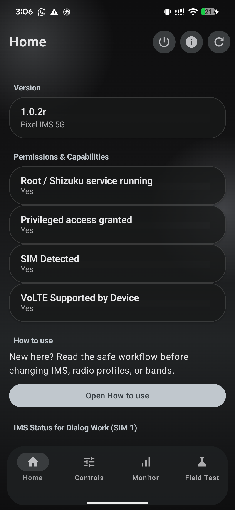
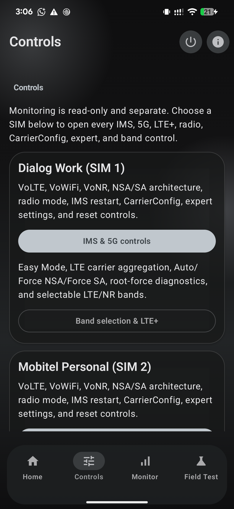
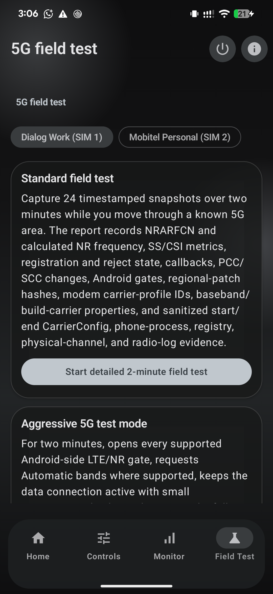
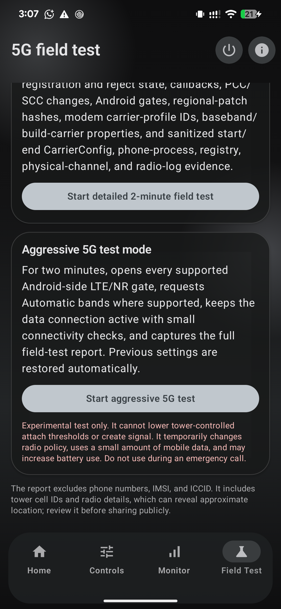
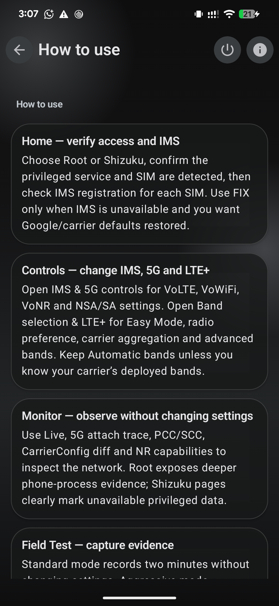

# Pixel IMS 5G [5G Works! : Sri Lanka]

An experimental root- or Shizuku-powered IMS and radio configuration app for Google Tensor Pixel phones. It uses model-independent Android telephony interfaces for Pixel 6 through Pixel 10, supports Android 16 and Android 17, and is developed and tested on a rooted Pixel 7 Pro running Android 17. [Note : You need root access to work 5G, with shizuku : VoLTE, LTE+, Bandlocking, Fieldtest, Other options are working]

Android application ID: `com.nirmala.pixel5gims`.

Current public release: `1.0.3`. The one-time uninstall/reinstall notice applies specifically
to version `0.12.6`, where the application ID changed. Existing `0.12.6` installations
can update normally to later versions.

## Version 1.0.2r interface

The app is now split into four purpose-built areas so IMS/5G controls and band
selection are easy to find:

| Home | Controls |
| --- | --- |
|  |  |
| **Field Test** | **Aggressive 5G test** |
|  |  |

The complete safety workflow is also available inside the app:

## How to use

1. Open **Home** and confirm the intended Root or Shizuku backend is running,
   privileged access is granted, and the correct SIM is detected.
2. Open **Controls**. Use **IMS & 5G controls** for VoLTE, VoWiFi, VoNR,
   NSA/SA, CarrierConfig and recovery. Use **Band selection & LTE+** for Easy
   Mode, automatic/NSA/SA preference, carrier aggregation and band selection.
3. Leave bands on **Automatic** first. A selected band is only an allow-list;
   the modem and network still decide the serving band and CA combination.
4. Use **Monitor** for read-only live IMS, IWLAN/VoWiFi, LTE+, 5G, serving-cell,
   neighbor-cell, signal-history and attach-trace evidence.
5. At a known 5G site, open **Field Test**. Run the standard two-minute test
   first. If needed, run **Aggressive 5G test**; it temporarily opens supported
   Android-side LTE/NR gates, makes small connectivity requests and restores the
   captured settings when it completes or is stopped.
6. Review exported reports before sharing: phone numbers, IMSI and ICCID are
   excluded, but cell IDs and radio measurements can indicate approximate
   location.
7. If service disappears after a change, use the offered **Undo** action. Use
   the power-button recovery only when you want to restore all active SIMs,
   clear the app recovery state and reboot.

Aggressive mode cannot lower network-controlled RSRP/RSRQ/SINR attachment
thresholds, create coverage, grant carrier entitlement, or make an LTE cell
advertise EN-DC. Do not run it during an emergency call.

## Verified 5G field result

Dialog Sri Lanka 5G NSA was verified on a Pixel 7 Pro near a live site. The capture
shows LTE B3 + B1 + B41 carrier aggregation with an n78 (3500 MHz) NSA secondary
cell. The matching field-test report exposed physical NR band 78, NRARFCN 628896,
PCI 883, approximately 3433.44 MHz downlink, and 100 MHz NR bandwidth.

| Live NSA connection | One field speed result |
| --- | --- |
|  |  |

The speed screenshot is one real-world result (471 Mbps down / 40.9 Mbps up), not a
performance guarantee. Coverage, site load, radio conditions, plan entitlement and
carrier policy all affect whether 5G attaches and how fast it runs.

## Features

- Enable VoLTE, VoNR, VoWiFi, NSA and SA carrier configuration.
- Apply NSA/LTE+NR preference or experimental SA/NR-only mode.
- Show live serving radio, LTE/NR bands, NR advertisement and EN-DC eligibility.
- Actively refresh cell measurements and infer omitted bands from EARFCN/NR-ARFCN.
- Request LTE/NR band restrictions and detect when Pixel firmware rejects them.
- On Pixel 6 modems without live band readback, apply restrictions through Android's result callback and retain the last callback-confirmed selection.
- Select LTE and NR bands using chips; every currently reported band stays green, including in Automatic mode.
- Enable per-SIM Easy Mode to apply VoLTE, enhanced LTE/LTE+, automatic bands, LTE+NR allowance, and verified Tensor CA enablement together.
- Lock advanced radio and band controls while Easy Mode is active, then unlock them without disabling calling settings.
- Preserve the original Tensor CA state so Undo and Restore All can return the modem to its previous value.
- Configure and recover each active SIM independently.
- Explain common IMS registration failures and restore Google/carrier defaults with one tap.
- Detect loss of service after an app change and undo the exact previous radio state.
- Restore every active SIM, clear the app's recovery state, and reboot from a guarded recovery action.
- Read the Tensor modem's LTE carrier-aggregation enablement status.
- Material 3 Expressive interface with dynamic Pixel colors and glass surfaces.
- Check GitHub Releases and download signed updates inside the app with live percentage/status, followed by Android's normal installation confirmation.
- Check GitHub Releases on launch and periodically in the background, then send one Android notification per newer signed release. Tapping **Update now** opens the in-app updater; notification permission and channel settings remain under the user's control.
- Choose Root or Shizuku at first launch and change the backend later from About.
- Monitor both SIMs live: IMS registration transport, VoWiFi/IWLAN state, Wi-Fi frequency, LTE/NR cells, signal metrics and history, and NSA/EN-DC advertisement.
- Detect Dialog, SLT-MOBITEL, Airtel Lanka, and Hutch SIM identities and show conservative Sri Lankan band and activation guidance.
- Apply a safe Sri Lankan/global compatibility profile without locking bands or claiming to bypass carrier provisioning.
- Use a per-SIM Root Force Lab to snapshot, force, audit, verify, and restore every Android-side LTE/NR gate exposed on Android 17.
- In Magisk Root mode, validate and stage a reversible systemless Tensor `cfg.db` wildcard/PTCRB compatibility mapping using the phone's own firmware database. The app refuses unknown schemas and never spoofs the SIM, PLMN, or Wi-Fi country.
- Run a two-minute, 24-sample 5G field test and export a privacy-labelled report to `Downloads/Pixel IMS 5G` with NRARFCN/frequency, SS/CSI measurements, registration/reject state, callback events, PCC/SCC history, CarrierConfig gates, and sanitized root evidence.
- Run a separate Aggressive 5G field test that temporarily opens supported Android-side LTE/NR gates, keeps data active with small connectivity checks, captures the same detailed evidence, and restores the pre-test settings even when stopped.
- Use the separate Monitoring section for TelephonyRegistry events, evidence-based 5G attach tracing, effective-vs-Android-default CarrierConfig differences, NR capability decoding, and root-only PCC/SCC physical channels.
- In Root mode, capture sanitized TelephonyRegistry, phone-service, and radio-log evidence. Shizuku mode clearly marks phone-process and `READ_PRECISE_PHONE_STATE` internals as unavailable.
- Display LTE+ only when Android confirms carrier aggregation, 5G NSA/SA only from connected NR state, and VoWiFi only from active IMS-over-IWLAN registration.

## Shizuku regional compatibility on Android 16 and 17

The dedicated Shizuku regional profile applies and verifies the
strongest reversible Android-side changes available to UID 2000: automatic bands,
LTE + NR user/carrier policies, NSA + SA CarrierConfig, VoLTE, VoWiFi, VoNR, LTE+ and
IMS visibility. The result screen reads the effective NR modes and network gates back
instead of treating a Binder call as proof of success.

On Pixel 6 firmware that rejects current-band readback, 1.0.2r keeps the Bands page
open, uses callback-confirmed selection state, and treats an unavailable Automatic
Bands reset as a clearly reported limitation instead of failing the complete Shizuku
regional profile.

This profile is not the Tensor `cfg.db` modem patch. The paired field-test reports show
that the modem profile change—not the identical Android CarrierConfig—was the decisive
difference in the tested Dialog NSA attach. Android 17 SELinux and verified vendor
partitions do not allow a normal Shizuku UID 2000 process to install a Magisk/vendor
overlay. If all Shizuku gates pass but the modem still rejects EN-DC, that exact modem
database fix remains root-only.

## Install

1. Have either a compatible root manager (Magisk, KernelSU, or APatch) or install and start [Shizuku](https://shizuku.rikka.app/).
2. Download the latest APK from [Releases](https://github.com/barrylk/Pixel-IMS-5G/releases/latest).
3. Install Pixel IMS 5G, choose Root or Shizuku, and approve that backend.

Changing radio modes can remove calls, SMS, or data. The app can change modem preferences and carrier configuration, but cannot create network coverage, EN-DC support, carrier authorization, or SA registration.

Root Force deliberately does not write modem NV/EFS. Those values are device- and baseband-specific; a mismatched Shannon NV profile can crash or disable the modem. The safe extension path is an exact-model, exact-baseband signed profile with backup and recovery—not a universal NV script.

The regional modem compatibility tool is experimental and Magisk-only. It validates the
stock database, patches a copy, performs SQLite integrity checks, and installs it as a
removable systemless module for the next reboot. It cannot create n78 coverage, make an
LTE cell advertise EN-DC, bypass subscriber/device entitlement, or force the network to
accept an SCG addition.

## Developer and support

Developed by **Nadeeja Nirmala**.

- [GitHub](https://github.com/barrylk)
- [Facebook](https://www.facebook.com/nirmalafromslk/)
- [Bug reports and feedback](https://github.com/barrylk/Pixel-IMS-5G/issues)

## Origin and license

Pixel IMS 5G is based on the original GPL project [kyujin-cho/pixel-volte-patch](https://github.com/kyujin-cho/pixel-volte-patch) and the work of its community contributors. Tensor wildcard/PTCRB `cfg.db` mapping research is credited to [vchikalkin/Pixel-Modem-Fix](https://github.com/vchikalkin/Pixel-Modem-Fix) and [Displax/modem-fix](https://github.com/Displax/modem-fix). This app independently validates and patches the current firmware database and does not redistribute either project's database or binary tools. This modified project remains licensed under the GNU General Public License v3.0. See [LICENSE](LICENSE).

This is an unofficial community project and is not affiliated with Google or any mobile carrier.

## Band scan limitations

The app requests a fresh cell-information measurement and lists every LTE/NR band the Android radio layer returns. When the radio omits a band but exposes an EARFCN or NR-ARFCN, the app derives the band using Android's radio-frequency mapping. No Android app can display a transmitter the modem does not measure or deliberately withholds from the framework.

`IWLAN` means the IMS service is registered through Wi-Fi; it is not an LTE/NR band. The monitor deliberately shows IMS transport, Wi-Fi frequency, and any cellular anchor as separate values.
